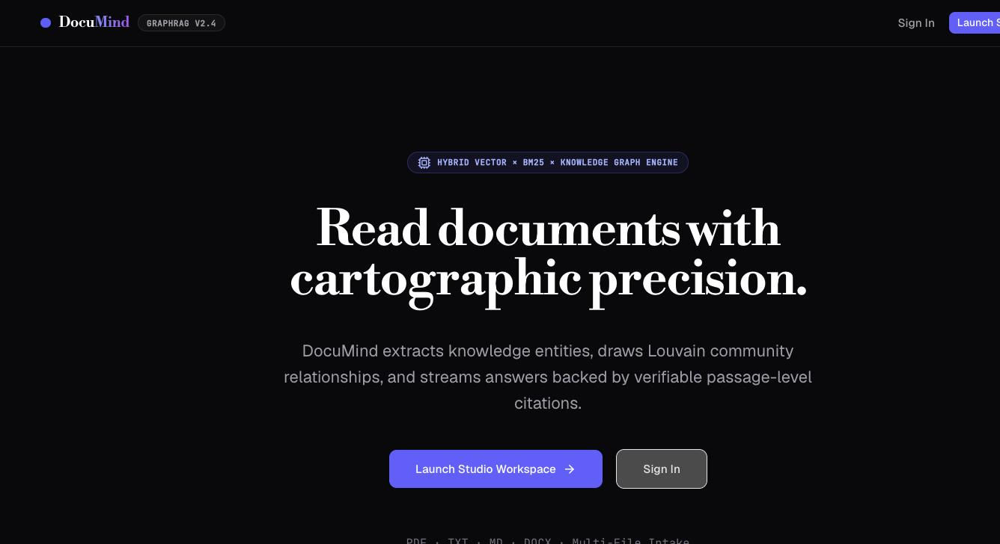
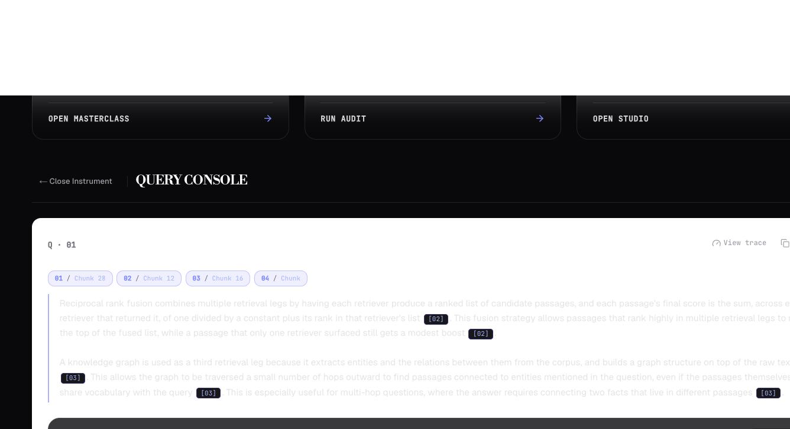
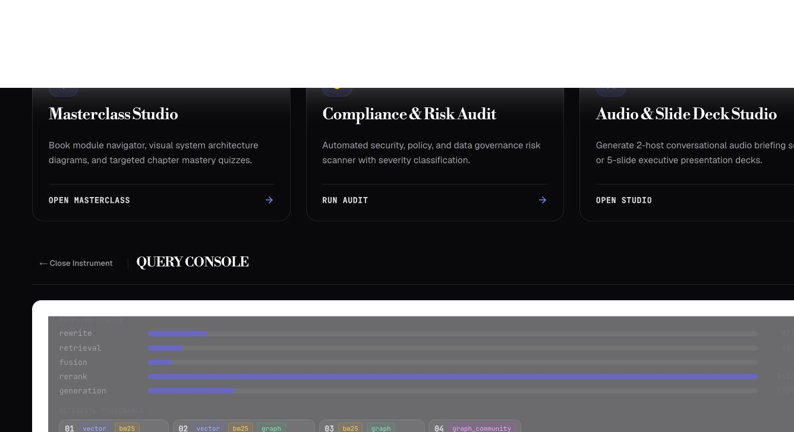
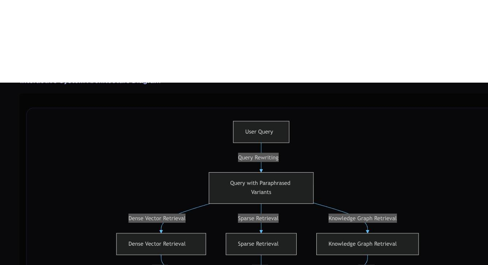

# DocuMind

Hybrid GraphRAG document intelligence. Upload a document and query it with a
retrieval stack that runs vector search, BM25 and knowledge-graph traversal in
parallel, fuses the results, reranks them, and streams back an answer with
passage-level citations.

Two services: a **FastAPI** backend (`microService/`) that does the indexing and
retrieval (fully tested, highly observable with tracing/logging), and a **Next.js 15** frontend (`frontend/`) using **shadcn-ui** for a clean, minimalist design.

<p align="center">
  
  
  <br/>
  
  
</p>

## Measured results

Retrieval ablation against a 40-question eval set (real gold chunk ids, generated
by an LLM over randomly sampled chunks from a 535-page technical book — see
[`microService/tuning/`](microService/tuning)). Each row adds one pipeline stage
on top of the last; the final row is the actual production config.

| Pipeline stage | Recall@10 | MRR | nDCG@10 |
|---|---|---|---|
| Vector-only (naive RAG) | 0.150 | 0.064 | 0.049 |
| + hybrid fusion (BM25 + graph, RRF) | 0.325 | 0.162 | 0.116 |
| + cross-encoder rerank | 0.375 | 0.336 | 0.178 |
| + multi-query rewrite (production config) | **0.425** | **0.352** | **0.194** |

**Hybrid retrieval + reranking + query rewriting improves Recall@10 by +183%
and MRR by +454% over naive vector-only search**, on identical chunking and
the identical eval set. Full numbers, methodology, and how to reproduce:
[`microService/tuning/results/scoped_ablation.md`](microService/tuning/results/scoped_ablation.md).

---

## How it works

**Indexing** (`POST /index`, streamed over SSE)

```
upload ──> sha256 (content-addressed; identical uploads reuse the index)
       ──> hierarchical chunking      parent sections + small child chunks
       ──> ┌ embeddings ─────────────> Chroma          (runs concurrently)
           └ LLM entity/relation extraction over a sample of parent chunks
       ──> NetworkX graph ──> Louvain communities ──> per-community summaries
       ──> persist: chroma/ graph.json bm25_corpus.pkl parents.json manifest.json
```

**Querying** (`POST /query`, streamed over SSE)

```
question ──> rewrite (HyDE + keywords + query variants)
         ──> ┌ vector search (per variant)
             ├ BM25
             ├ graph traversal from matched entities
             └ community summaries
         ──> weighted reciprocal rank fusion (k=60)
         ──> cross-encoder rerank
         ──> small-to-big: each child chunk swapped for its parent section
         ──> stream answer + [n] citations
```

Every request writes stage latencies, token counts and the retrieved context to
a SQLite trace, readable at `GET /trace/{request_id}`.

## Features

| | |
|---|---|
| **Query console** | Streamed answers with clickable `[n]` citations back to source chunks |
| **Summary** | Executive summary of the document |
| **Quiz arena** | Generated multiple-choice questions, scored, with review mode |
| **Knowledge atlas** | Force-directed view of the extracted entity graph, coloured by community |
| **Masterclass studio** | Chapter breakdown, streamed learning drafts, per-chapter quizzes |
| **Compliance audit** | Findings and mitigations extracted from the document |
| **Audio briefing** | Two-host podcast script |
| **Slide deck** | Presentation outline with speaker notes |
| **Telemetry** | Request counts, latency and token usage from the trace store |

## Running it

Requires Python 3.12+, Node 18.18+, and — only for OCR of scanned PDFs —
`tesseract` and `poppler`.

**Backend**

```bash
cd microService
python3 -m venv .venv && .venv/bin/pip install -r requirements.txt
cp .env.example .env          # then set an API key, see below
.venv/bin/python -m uvicorn app.main:app --reload --port 8000
```

**Frontend**

```bash
cd frontend
npm install
cp .env.example .env          # then set JWT_SECRET
npm run dev                   # http://localhost:3000
```

`/Dashboard` is behind auth, so sign up once at `/signup` before using it.

**Tests**

```bash
cd microService && ./run_tests.sh        # 182 tests
cd frontend && npx tsc --noEmit && npm run lint && npm run test   # + npm run test:e2e (Playwright)
```

## Configuration

The backend reads ~45 environment variables; these are the ones that matter.
Everything else is a retrieval tuning knob with a sensible default — see
`microService/app/config/settings.py`.

| Variable | Default | |
|---|---|---|
| `LLM_PROVIDER` | `openrouter` | `openrouter` \| `groq` \| `nvidia` |
| `OPENROUTER_API_KEY` | — | required for the default provider |
| `RAG_EMBED_MODEL` | `BAAI/bge-small-en-v1.5` | local by default; `nvidia/...` uses NVIDIA NIM |
| `RAG_PERSIST_DIR` | `./local_chroma` | where indexes live |
| `RAG_MAX_FILE_MB` | `100` | per-file upload cap |
| `RAG_MAX_GRAPH_CHUNKS` | `25` | parent chunks sampled for graph extraction |
| `RAG_GRAPH_EXTRACT_TIMEOUT_S` | `60` | per-chunk extraction budget |
| `RAG_RERANK_MODE` | `cross_encoder` | `cross_encoder` \| `llm` \| `off` |
| `RAG_CORS_ORIGINS` | `http://localhost:3000` | comma-separated |
| `RAG_TESSERACT_CMD` | — | set if `tesseract` is not on `PATH` |

Frontend: `RAG_BACKEND_URL` (default `http://localhost:8000`), `JWT_SECRET`
(**required**, no fallback), `MONGODB_URI` (optional — accounts fall back to a
local JSON file).

**Changing `RAG_EMBED_MODEL` invalidates existing indexes.** Embeddings of
different dimensions cannot be queried against the same Chroma collection; the
model is recorded in each `manifest.json` so a mismatch is detectable. Re-index
after switching.

## Known limitations

Worth stating plainly, because several of them shape what the output means.

- **Graph extraction samples.** Entity/relation extraction runs over at most
  `RAG_MAX_GRAPH_CHUNKS` (25) parent sections, chosen at an even stride. On a
  long document the knowledge graph is built from a sample, not the whole text.
  The indexing stream emits a warning when this happens.
- **Generated artifacts sample too.** Summary, quiz, audit, briefing and slides
  each work from 8–16 parent sections. Every response carries a `coverage`
  object and the UI states what it was derived from. Vector and BM25 retrieval
  do cover the whole document — this caveat applies to the generated artifacts,
  not to querying.
- **Document ownership is opt-in, not retroactive.** Documents are tagged with
  an `owners` list at index time and access-checked on every read (`403` if
  you're not an owner). Documents indexed before this existed carry no
  `owners` key at all and stay visible to everyone — a deliberate
  backward-compat choice, not a bug.
- **The backend requires a valid JWT** (verified independently of the
  frontend, `HS256`, shared `JWT_SECRET`) on every document-scoped route, and
  is rate-limited per client IP (`/index` 5/min, `/query` 20/min, studio
  routes 10/min by default). It still assumes it is not the public edge of
  the system — put it behind the frontend, not directly on the internet.
- **Cost tracking is partial.** Token counts are recorded; `MODEL_PRICING` is
  empty, so costs report as unknown for most models.

## Layout

```
microService/
  app/
    main.py            composition root — lifespan, CORS, routers
    routes/            HTTP handlers (documents, query, studio, masterclass, telemetry)
    services/          business logic independent of HTTP
    indexing/          pipeline, graph extraction, communities, persistence
    retrieval/         orchestrator, search, rewriter, reranker
    core/              LLM client, embeddings, cache, SSE, observability
    config/            typed settings
  tests/               unit / integration / api / e2e
  tuning/              retrieval parameter sweep + report (manual)
frontend/
  app/
    Dashboard/         the application shell
    components/        chat, graph, quiz, masterclass, mermaid
    api/rag/           proxy routes to the backend (see api/rag/_lib/proxy.ts)
    api/auth/          signup / signin / signout
  lib/                 sse parsing, formatting, auth helpers
  middleware.ts        gates /Dashboard
```

## License

[MIT](LICENSE)
